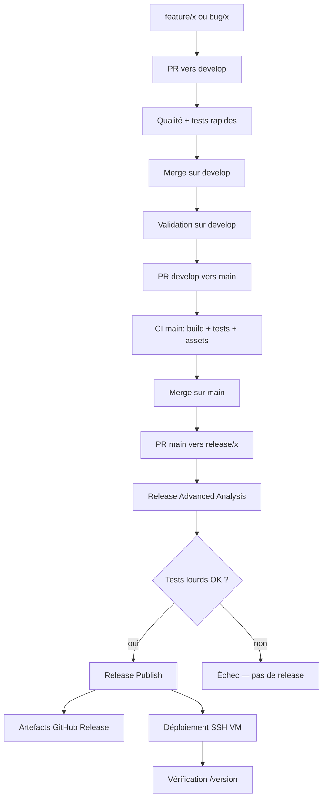

# Rapport CI/CD — Projet Simeis

**Auteurs :** Maxence Perronié (mxncp85 / K4OS) & Cedric Toe (Cedric-Law)
**Dépôt :** [mxncp85/simeis-ci-cd](https://github.com/mxncp85/simeis-ci-cd)

---

## 1. Introduction

Ce rapport décrit la chaîne CI/CD mise en place pour le projet **Simeis** : intégration continue sur les pull requests, publication de releases, construction de paquets Debian et d’images Docker, puis déploiement automatique sur une VM.

---

## 2. Stratégie de branches

Le développement suit un modèle **Git Flow simplifié** :

| Branche | Rôle |
|---|---|
| `main` | Intégration continue des features et bugfixes |
| `develop` | Branche de test afin de valider le code et le pousser sur la branche main |
| `feature/x` | Nouvelle fonctionnalité → merge vers `main` |
| `bug/x` | Correction de bug → merge vers `main` |
| `release/x.y.z` | Préparation et publication d’une version |

**Choix :** séparer `develop` (développement), `main` (développement approuvé) et `release/x` (stabilisation) permet d’exécuter des tests plus lourds uniquement avant une release, sans ralentir chaque PR.

**Garde-fou :** le workflow `pr-release-source-guard.yml` ferme automatiquement toute PR vers `release/**` dont la source n’est pas `main` ou `bug/x`. Cela évite qu’une branche `feature/` instable arrive directement en release.

---

## 3. Vue d’ensemble du pipeline



**Idée clé :** le code passe d’abord par `develop` pour être testé et validé, puis est intégré sur `main`. La CD (release + déploiement) n’est déclenchée qu’après validation par une analyse avancée sur la branche `release/x`.

---

## 4. Intégration continue (CI) sur les pull requests

### 4.1 Qualité du code (`pr-quality.yml`)

À chaque PR, deux jobs parallèles :

**Job `quality`**
- `cargo fmt --check` : vérifie le formatage Rust
- `cargo clippy -D warnings` : analyse statique, warnings traités comme erreurs
- `black --check` : formatage Python, **uniquement sur les fichiers `.py` modifiés** dans la PR

**Pourquoi on met `fetch-depth: 0` ?**  
Par défaut, GitHub Actions ne télécharge qu’un **clone shallow** : avec `fetch-depth: 1`, on récupère seulement le dernier commit, pas tout l’historique du repo. C’est plus rapide, mais chez nous ça posait problème : pour vérifier le formatage Python avec Black, on doit comparer les fichiers modifiés dans la PR via `git diff` entre le commit de base (`develop` ou `main`) et le commit de la branche. Or avec un historique tronqué, Git n’a pas toujours accès au commit de base → le diff ne fonctionne pas correctement. En mettant `fetch-depth: 0`, on force le clone **complet** de l’historique, et `git diff` peut enfin comparer les deux commits comme en local.

**Job `review-required`**  
Utilise `gh api` pour compter les reviews `APPROVED`. La PR échoue sans au moins une approbation humaine.

**Mécanisme :** `concurrency` + `cancel-in-progress: true` annule les runs obsolètes quand de nouveaux commits arrivent sur la PR — gain de temps et de minutes CI.

### 4.2 Tests unitaires (`ci.yml`, job `dev`)

Sur toute PR (et push hors `main`) : `cargo test --workspace`.

### 4.3 Couverture de code (`pr-coverage.yml`)

`cargo tarpaulin` mesure la couverture sur le répo complet. Si elle est **< 50 %**, le label `not enough tests` est ajouté à la PR via `gh pr edit`.

**Motivation :** signaler visuellement un manque de tests sans bloquer systématiquement le merge (le label alerte le reviewer).

### 4.4 Tests property-based (`pr-property-based.yml` / `propertybased.py`)

Les tests property-based vérifient des **propriétés mathématiques** sur de nombreuses entrées aléatoires (addition, distance 3D), plutôt que quelques cas fixes.

| Contexte | Durée | Commande |
|---|---|---|
| PR (rapide) | ~3–10 s | `python tests/propertybased.py --time 3` |
| Release (lourd) | 120 s/test | `python tests/propertybased.py --heavy` |

En cas d’échec, la **seed** aléatoire est affichée pour reproduire le bug localement.

### 4.5 Contrôle des TODO (`todo-issue-check.yml`)

Analyse uniquement les TODO **introduits dans le diff** (pas tout le dépôt, uniquement le code modifié). Chaque TODO doit référencer une issue GitHub ouverte (`#123`), classée en Features / Bugfix / Autre selon le contexte.

**Choix :** éviter l’accumulation de dette technique et de commentaire TODO qui pollue le code.

---

## 5. CI sur `main` (`ci.yml`, job `release`)

Après merge sur `main` :
1. Tests unitaires
2. `make ci-release` → binaire release + manuel PDF
3. Publication d’un build intermédiaire via `gh release` (tag `build-<sha>`)

Ce job prépare les artefacts sans déclencher une release officielle `vX.Y.Z`.

---

## 6. Analyse avancée sur `release/x` (`release-advanced-analysis.yml`)

**Déclencheur :** `push` sur `release/**` (donc après merge d’une PR vers `release/x`).

Trois jobs **parallèles** :

| Job | Contenu |
|---|---|
| `rust-heavy-tests` | Tests `heavy-testing`, build serveur, scénarios fonctionnels Python |
| `property-heavy` | Property-based long (`--heavy`) |
| `security-audit` | `cargo audit` + `cargo udeps` (nightly) |

**Pourquoi nightly pour `udeps` ?**  
L’outil `cargo-udeps` détecte les dépendances déclarées mais inutilisées en s’appuyant sur des APIs internes du compilateur Rust, disponibles seulement sur la toolchain **nightly**. Le code applicatif reste compilé en **stable**.

---

## 7. Publication de release (`release-publish.yml`)

**Déclencheur :** succès du workflow `Release Advanced Analysis` (`workflow_run`), ou relance manuelle (`workflow_dispatch`).

### 7.1 Artefacts produits

| Artefact | Description |
|---|---|
| `simeis-server` | Binaire Rust release |
| `simeis-ci-cd_X.Y.Z-1_amd64.deb` | Paquet Debian |
| `manual.pdf` | Manuel utilisateur |
| `swagger.json` | Spécification API |
| `simeis-sdk-python.py` | SDK Python |
| `simeis-server-X.Y.Z-docker-image.tar` | Image Docker exportée |

### 7.2 Changelog automatique

Le script `generate_release_changelog.py` interroge l’API GitHub (`gh pr list --state merged`) et classe les PR selon leur branche source :

- **Features** ← `feature/*`
- **Bugfix** ← `bug/*`
- **Autre** ← reste

Le changelog est injecté dans la release GitHub.

### 7.3 Choix technique : `gh` plutôt qu’actions marketplace

Conformément aux consignes du TP, la publication repose sur :
- `actions/checkout@v6` (seule action marketplace « générique »)
- `gh` et scripts bash/python pour le reste
- une image Docker pré-construite (`ghcr.io/mini-bomba/create-github-release`) pour créer la release

**Motivation :** limiter la dépendance à des actions tierces tout en réutilisant un outil CLI officiel.

---

## 8. Paquet Debian

### 8.1 Construction (`packaging/build-deb.sh`)

Le paquet est construit selon le HOWTO **dpkg-deb + fakeroot** (sans `debuild` complet) :

1. Création d’un **staging** (`build/deb/staging/`) mimant l’arborescence cible (`/usr/bin`, `/etc/systemd/system`, etc.)
2. Génération du fichier `control` depuis un template `control.in`
3. Inclusion des scripts `postinst`, `prerm`, `postrm`
4. `fakeroot dpkg-deb --build` pour produire le `.deb`

**Nom unique du paquet (TP7) :** `simeis-ci-cd` — évite les conflits.

### 8.2 Installation sur la cible

Le script `postinst` :
- crée l’utilisateur système `simeis`
- fixe les permissions du binaire
- active et démarre le service `simeis-server` via systemd

**Dépendances déclarées :** `cmatrix`, `systemd`.

### 8.3 Service et port

Le serveur écoute sur le port **9450** (TP7). L’endpoint `GET /version` renvoie la version Cargo (`0.1.4` selon les `Cargo.toml`).

---

## 9. Dockerisation (`.github/dockerfile`)

Image multi-étapes :
- **Builder :** image Rust (base imposée par le TP)
- **Runtime :** `debian:bookworm-slim`, utilisateur `nobody`, port `9450`

**Contrainte rencontrée :** `ntex 3.9.x` exige Rust ≥ 1.88, incompatible avec `rust:1.85.0-bookworm` pour une compilation dans l’image. **Solution retenue :** compiler le binaire en CI (`make ci-release`), puis le **copier** dans l’image Docker. L’image contient bien le logiciel compilé, sans recompiler dans un environnement incompatible.

L’archive `docker image save` permet de distribuer l’image sans registry obligatoire.

---

## 10. Déploiement continu (TP7)

### 10.1 Principe

Après publication de la release, le workflow :
1. Copie le `.deb` sur la VM via **SCP**
2. Installe le paquet via **SSH** (`apt install`)
3. Vérifie localement le service et `GET /version`
4. Vérifie depuis l’extérieur que la version distante est correcte

### 10.2 Scripts

| Script | Rôle |
|---|---|
| `deploy_vm.sh` | Config SSH, test connexion, `scp`, `apt install`, checks locaux |
| `verify_deploy.sh` | `curl http://<host>:9450/version` + comparaison de version |

### 10.3 Secrets et variables GitHub

| Type | Nom | Rôle |
|---|---|---|
| Variable | `DEPLOY_SSH_HOST` | IP de la VM |
| Variable | `DEPLOY_SSH_USER` | Utilisateur SSH (`student`) |
| Variable | `DEPLOY_SSH_PORT` | Port SSH (`22222`) |
| Secret | `DEPLOY_SSH_PRIVATE_KEY` | Clé privée pour l’authentification |

**Point d’attention :** `ssh` utilise `-p` pour le port, `scp` utilise `-P` (majuscule). Une confusion provoque des erreurs silencieuses (`scp` interprète le port comme un fichier local).

**Échec du job si :** connexion impossible, mauvaise version retournée par `/version`, ou service inactif.

### 10.4 Difficultés rencontrées (déploiement automatique)

La partie **génération des artefacts** (`.deb`, release GitHub, scripts `deploy_vm.sh` / `verify_deploy.sh`, variables et secrets) a pu être mise en place et validée : le workflow compile, construit le paquet et tente bien l’étape de déploiement.

En revanche, la **connexion SSH depuis GitHub Actions vers la VM** n’a pas pu être finalisée à ce jour. Malgré plusieurs tentatives de configuration, le job échoue systématiquement à l’authentification (`Permission denied (publickey)`), alors que la connexion manuelle depuis un poste de développement peut sembler fonctionner.

Pistes investiguées sans succès définitif :
- alignement entre la clé privée dans le secret `DEPLOY_SSH_PRIVATE_KEY` et la clé publique dans `~/.ssh/authorized_keys` sur la VM ;
- choix du bon utilisateur (`ko` vs `student`) : la clé autorisée peut être enregistrée sur un compte différent de celui utilisé par la CI ;
- confusion entre plusieurs paires de clés sur le poste local (empreinte `...MbUT` sur le PC vs `...EGVG` sur la VM) ;
- correction de l’option port pour `scp` (`-P` et non `-p`) ;

**État actuel :** le pipeline de release et la production des fichiers sont opérationnels ; le déploiement automatique reste **bloqué au stade de l’authentification SSH** entre le runner GitHub et la VM. Le déploiement manuel du `.deb` (téléchargement depuis la release + `scp` / `apt install`) reste la solution de contournement.

---

## 11. Propagation automatique des bugfixes (`propagate-bugfix.yml`)

Quand une PR depuis `bug/x` est mergée, si elle porte le label `propagate:release/0.1.4`, le workflow crée automatiquement une PR vers `release/0.1.4`.

**Mécanisme :**
1. Lecture des labels via `gh pr view --json labels`
2. Regex bash `^propagate:(release/.+)$` pour extraire la branche cible
3. Création d’une branche `propagate/bug-...-to-release-...` et `gh pr create`

**Motivation :** corriger une release déjà publiée sans process manuel.

---

## 12. Actions locales réutilisables

Pour éviter la duplication dans les workflows :

| Action | Rôle |
|---|---|
| `setup-rust` | Installation Rust + cache Cargo (`actions/cache@v4`) |
| `install-cargo-tool` | Installation pinée d’outils (`typst`, `tarpaulin`, `cargo-audit`…) |
| `setup-python-black` | Installation Black avec cache pip |

**Cache Cargo :** la clé inclut `hashFiles('**/Cargo.lock')` — le cache est invalidé quand les dépendances changent.

---

## 13. Choix transverses et compromis

| Choix | Avantage | Inconvénient |
|---|---|---|
| Workflows séparés par préoccupation | Lisibilité, parallélisme | Plus de fichiers à maintenir |
| `concurrency` + cancel | CI plus rapide | Run annulé = check GitHub « cancelled » |
| Tests lourds seulement sur `release/x` | PR fluides | Bug détecté tard si pas de tests locaux |
| Paquet `dpkg-deb` minimal | Simple, conforme HOWTO | Pas de lintian automatique |
| Binaire copié dans Docker | Contourne conflit MSRV | Double étape build + image |
| Déploiement SSH | Simple, sans orchestrateur | Dépend de la config réseau/clés VM |

---

## 14. Difficultés rencontrées

1. **MSRV Rust / ntex :** compilation impossible dans `rust:1.85.0-bookworm` → copie du binaire pré-compilé.
2. **Authentification SSH CI (TP7) :** la clé publique sur la VM doit correspondre exactement à la clé privée du secret GitHub, pour le **bon utilisateur** (`student`, pas `ko`). À ce jour, malgré la génération correcte des artefacts et la configuration des scripts de déploiement, la connexion depuis les runners GitHub échoue toujours (`Permission denied (publickey)`). Plusieurs pistes ont été testées (utilisateur, paire de clés, format du secret, options `scp`/`ssh`) sans résolution complète.
3. **scp vs ssh :** option port différente (`-P` vs `-p`).

---

## 15. Comment tester localement

```bash
# Tests et build
make test
make release
make deb VERSION=0.1.4

# Property-based
python tests/propertybased.py
python tests/propertybased.py --heavy

# Docker (après make release)
docker build -f .github/dockerfile -t simeis-server:0.1.4 .
docker run --rm -p 9450:9450 simeis-server:0.1.4
```

---

## 16. Conclusion

La chaîne CI/CD de Simeis couvre l’ensemble du cycle : **qualité et tests rapides sur PR**, **analyse approfondie avant release**, **publication multi-artefacts**, et **déploiement vérifié** sur une VM distante (implémenté dans le workflow, mais bloqué en pratique par l’authentification SSH vers la VM au moment de la rédaction de ce rapport).

Les choix privilégient la **simplicité** (scripts bash, `gh`, `dpkg-deb`) et la **traçabilité** (changelog depuis les PR, labels de couverture, garde-fous sur les branches release), tout en restant conformes aux contraintes pédagogiques du projet (peu d’actions marketplace, code commenté pour le correcteur).
